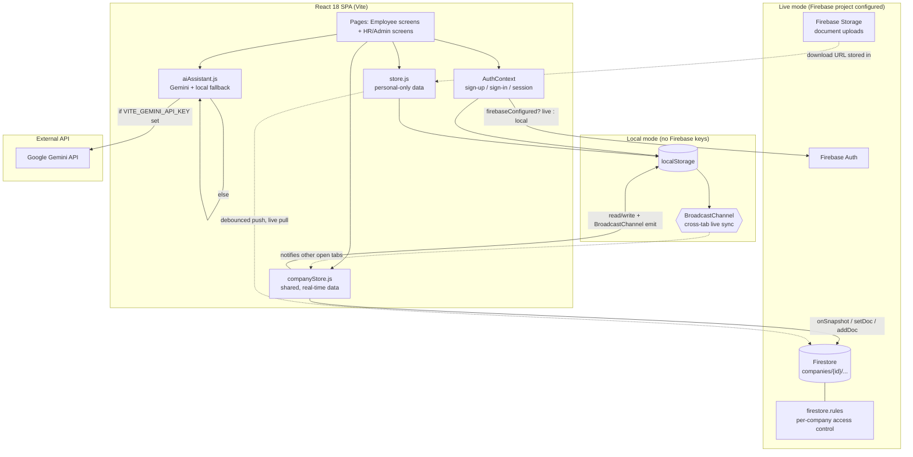
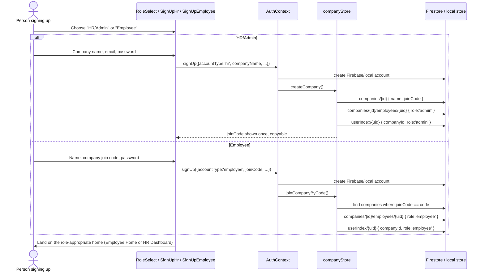
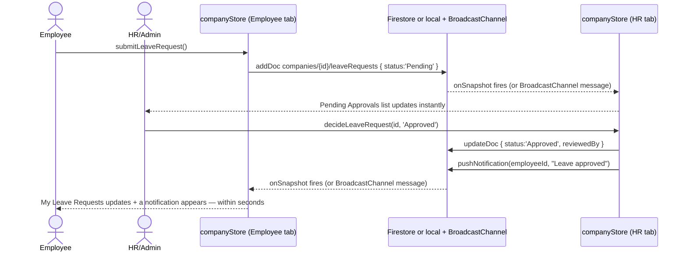

# Architecture

## 1. System overview

**The one decision that shapes everything else:** any data that both an Employee and their HR/Admin need to see and act on together (leave, attendance, tickets, announcements, notifications, payroll, peer feedback, the employee directory) lives in **`companyStore.js`**, scoped by a real `companyId`. Anything private to one account (profile edits, uploaded document metadata, app settings) lives in **`store.js`**, scoped by that account's `uid`. No screen ever guesses which backend is active — both stores expose the same function signatures whether they're backed by Firestore or by localStorage + BroadcastChannel.

## 2. Sign-up: role selection creates the company relationship

On every subsequent app load, `AuthContext` reads `userIndex/{uid}` (Firestore) or the equivalent local record to recover `{ companyId, role }` before rendering anything — this is what lets `ProtectedRoute`/`RoleRoute` send an HR/Admin straight to `/app/dash/hr` and an Employee to `/app/home`.

## 3. The flagship real-time loop: leave approval

The same pattern (write from one role, both roles' live subscriptions update) powers helpdesk tickets, payroll issuance, announcements, and peer feedback — see `docs/DIAGRAMS.md` for each one individually.

## 4. Security model in one sentence

**An employee can always read/write their own records; an HR/Admin can read and update any record inside their own company; nobody can touch another company's data at all** — enforced in `firestore.rules`, not just hidden in the UI. Full reasoning and the rule-by-rule breakdown is in `docs/DATABASE.md`.

## 5. Why two data stores instead of one

The original single-document-per-user design (kept as `store.js`) cannot express "HR approves employee X's request and X sees it change" — there is structurally only one profile, so there is no one else to notify. `companyStore.js` exists because real HR software's entire value is in that connection: every collection carries a `companyId` and (where relevant) an `employeeId`, so a query can express exactly "everyone in my company" or "just me," and a security rule can enforce who's allowed to ask for which.

## 6. Known scope boundaries

See the README's [Known scope boundaries](../README.md#known-scope-boundaries) section — repeated here because it matters architecturally: payroll, performance reviews, and biometric/OCR features are intentionally scoped to what a frontend can honestly deliver without a real payroll provider, ML model, or hardware API behind it.
