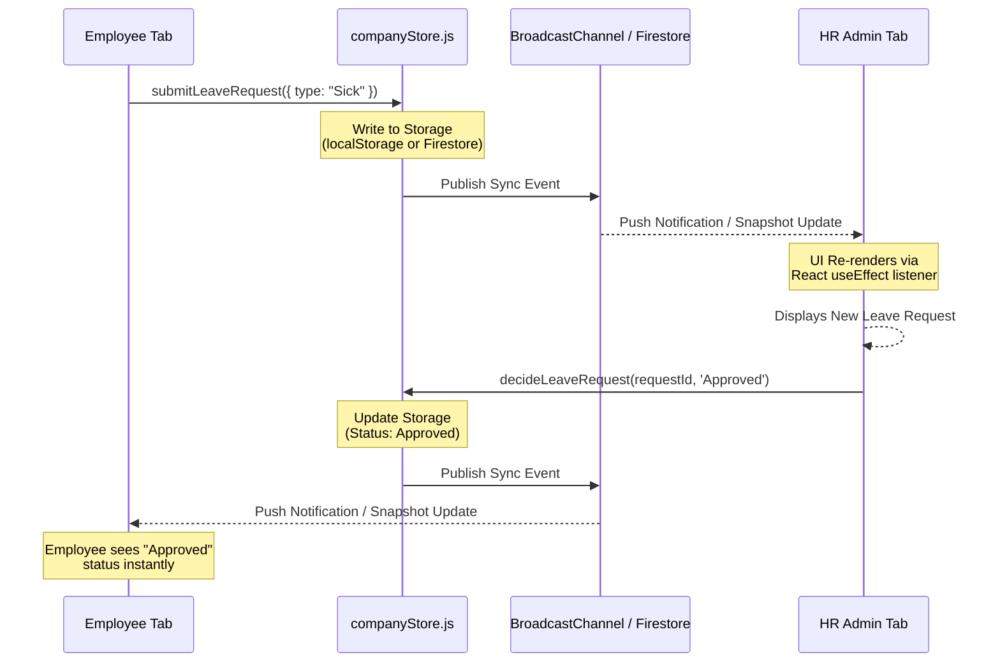
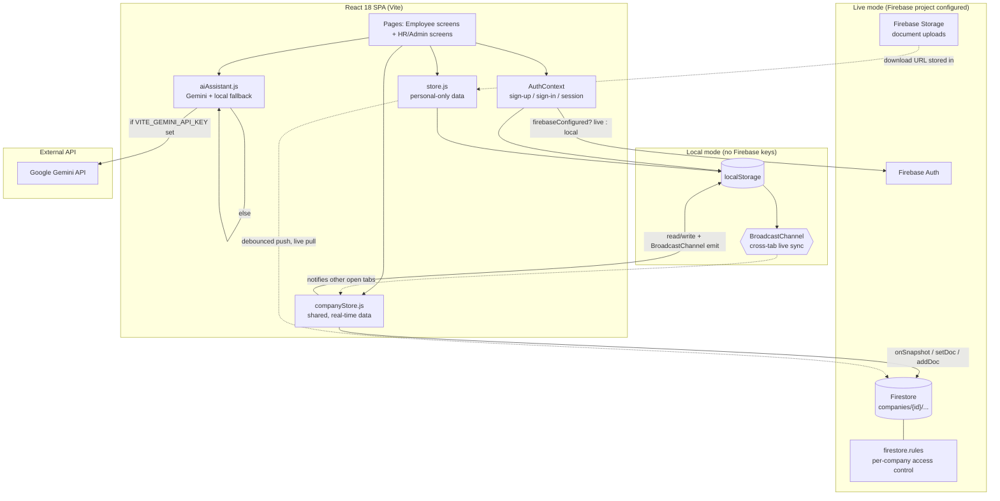
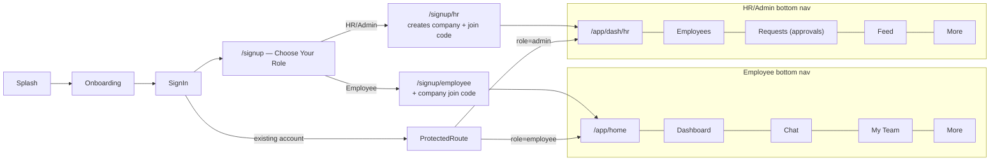
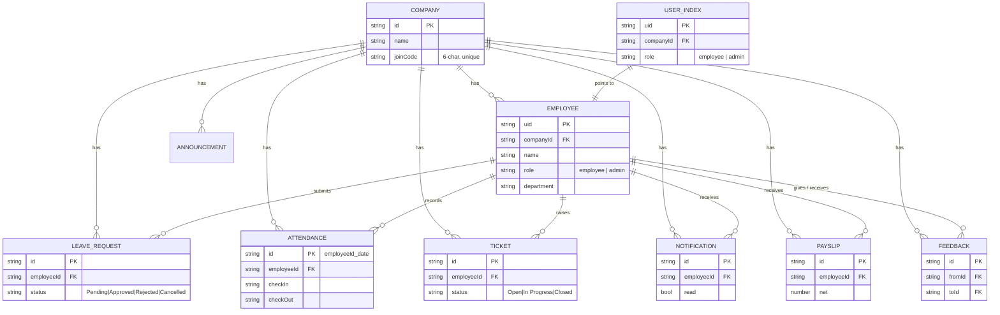
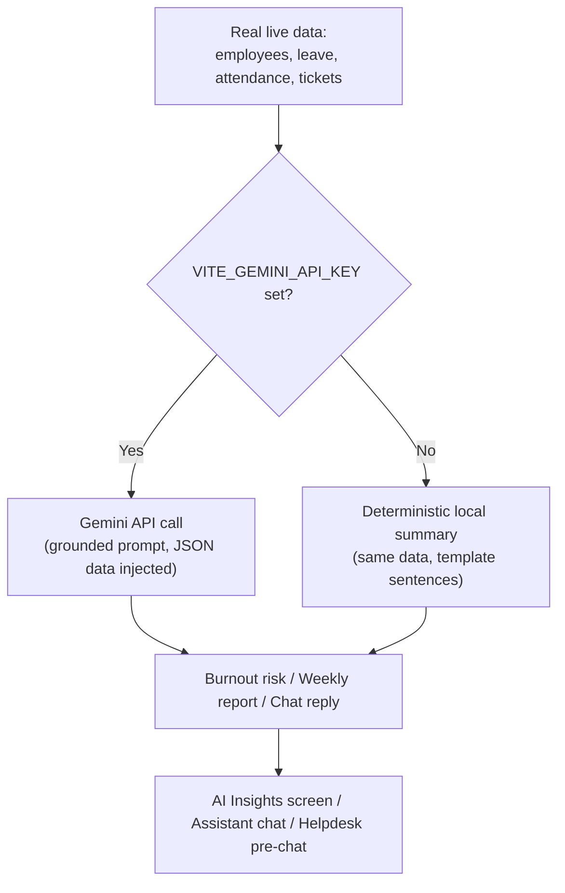
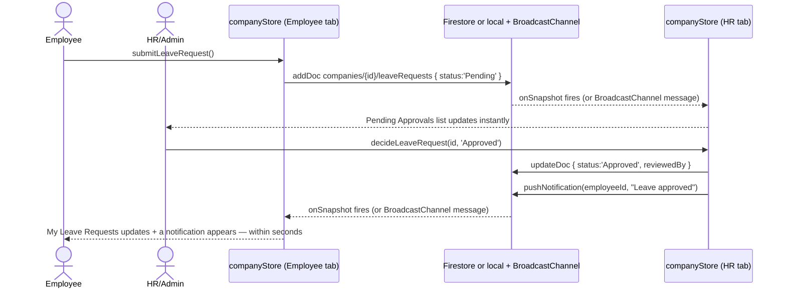
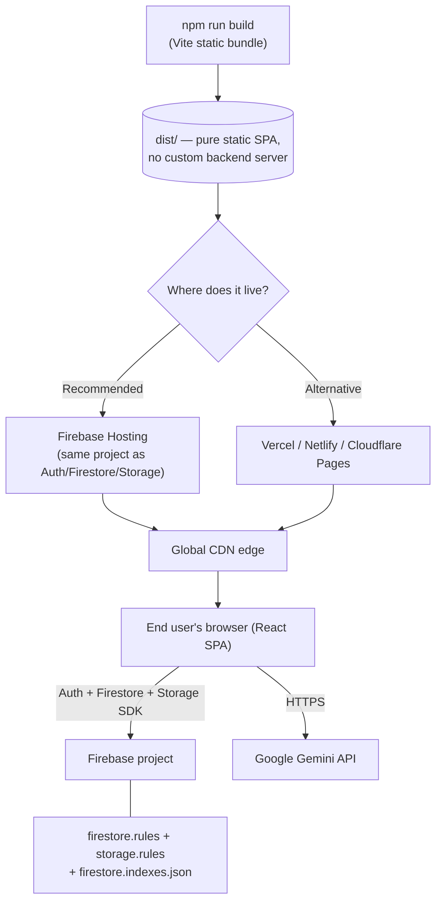

# PulseHR AI

<div align="center">
  <a href="YOUR_LIVE_DEMO_LINK_HERE">
    
  </a>
  &nbsp;&nbsp;
  <a href="YOUR_YOUTUBE_LINK_HERE">
    
  </a>
</div>
<br/>

## 🏆 HACKATHON JUDGES: HOW TO TEST

Welcome judges! To truly experience this application, you must test the real-time syncing and the Agentic AI. The app works instantly with **zero configuration** (using a `BroadcastChannel` local backend).

### Step 1: Real-Time Sync Testing (Requires 2 Tabs)
1. Open the Live Demo link in **Tab 1**. Sign up as **HR/Admin**. Note the 6-character Company Join Code.
2. Open the Live Demo link in **Tab 2** (side-by-side). Sign up as **Employee** using that Join Code.
3. In the Employee tab, submit a leave request or check-in for attendance.
4. Watch the HR tab update **instantly** without refreshing.

#### 🏗️ Real-Time Event Architecture Diagram
*As required by the evaluation criteria, here is the real-time synchronization event flow diagram:*


### Step 2: Agentic AI Function Calling Testing
This app features a fully autonomous Agentic AI powered by Gemini 2.5 Flash.
1. Go to the **Assistant** tab.
2. Ask the AI: *"My laptop screen is broken, please raise a ticket for me."*
3. The AI will autonomously extract the intent, prioritize the issue, and execute a background function to insert a real ticket into the database. Check the Helpdesk tab to see it!

---

A mobile-first HR platform with **two genuinely different, permission-separated apps sharing one live company**: an Employee experience and an HR/Admin experience. When HR approves a leave request, the employee sees it change within seconds. When an employee joins with a company code, they instantly appear in HR's directory. That connection is real — enforced by database security rules, not just by the UI.

```
npm install
npm run dev
```

Open the printed local URL. The app works immediately with **zero configuration** — sign up as HR/Admin to create a company, or as an Employee with a company join code, and every action is real, persisted, and (across browser tabs) live. See [Run modes](#run-modes) below for exactly what that means.

## What this actually is

This is a frontend application with a real, working data and auth layer — not a backend service, not a hosted SaaS, and not a payroll/compliance system. It is meant to be read and evaluated as a **product-quality client** that a real backend team could put an actual company behind. Section [Known scope boundaries](#known-scope-boundaries) says plainly what still needs real infrastructure (a live Firebase project, a payroll provider, etc.) that only you can provision — no amount of code can stand in for your own cloud account.

## Documentation

| Doc | Covers |
|---|---|
| [`ARCHITECTURE.md`](./ARCHITECTURE.md) | The company/employee data model, real-time sync design, security model, in prose |
| [`docs/DIAGRAMS.md`](./docs/DIAGRAMS.md) | Every remaining flow as a Mermaid diagram: leave state machine, attendance, helpdesk, payroll, peer feedback, full navigation map |
| [`docs/DATABASE.md`](./docs/DATABASE.md) | Full Firestore schema, path layout, security-rule-by-rule reasoning |
| [`docs/FEATURES.md`](./docs/FEATURES.md) | Every module, and exactly what's real vs. a documented placeholder in it |
| [`docs/INSTALLATION.md`](./docs/INSTALLATION.md) | Setup, environment variables, troubleshooting |
| [`docs/DEPLOYMENT.md`](./docs/DEPLOYMENT.md) | Firebase Hosting / Vercel / Netlify, env vars, production hardening |
| [`docs/AI.md`](./docs/AI.md) | Gemini integration, prompt design, offline fallback behavior |
| [`docs/API.md`](./docs/API.md) | Internal module contracts (`companyStore.js`, `store.js`, `cloudSync.js`, `aiAssistant.js`) |

---

## Diagrams

Six diagrams cover the whole system end to end. Every other flow (leave state machine, attendance, helpdesk, payroll, peer feedback, the full navigation map) lives in [`docs/DIAGRAMS.md`](./docs/DIAGRAMS.md) and is linked from the relevant section below.

### 1. System Architecture



Any data that both an Employee and their HR/Admin need to see and act on together (leave, attendance, tickets, announcements, notifications, payroll, peer feedback, the employee directory) lives in **`companyStore.js`**, scoped by a real `companyId`. Anything private to one account lives in **`store.js`**, scoped by that account's `uid`. Both stores expose identical function signatures whether they're backed by Firestore or by localStorage + BroadcastChannel — no screen ever branches on which one is active. Full reasoning: [`ARCHITECTURE.md`](./ARCHITECTURE.md).

### 2. User Flow



Role is chosen once, at sign-up, and determines both which sign-up form appears and which bottom navigation and home screen the account lands on for good — see [`docs/DIAGRAMS.md#navigation--role-split`](./docs/DIAGRAMS.md#navigation--role-split) for the full map including every route.

### 3. Database / Firestore



Every shared document carries a real `companyId` (and usually an `employeeId`) — that single fact is what lets both a query and a `firestore.rules` security rule say "only this company" or "only this person." Full path layout, field lists, and the security-rule-by-rule reasoning: [`docs/DATABASE.md`](./docs/DATABASE.md).

### 4. AI Workflow



Both paths are grounded in the same real subscriptions — the local fallback never invents a number that isn't in the data it was given, and it never states a specific personal figure (leave days, payslip amount) it can't actually see. Prompt design and the exact `kind` values: [`docs/AI.md`](./docs/AI.md).

### 5. Employee ↔ HR Flow



This is the flagship proof that the two apps are actually connected, not just visually similar. The identical write-from-one-role/both-roles-update pattern also drives helpdesk tickets, payroll issuance, announcements, and peer feedback — each diagrammed individually in [`docs/DIAGRAMS.md`](./docs/DIAGRAMS.md).

### 6. Deployment Architecture



No servers to provision — it's a static bundle on a CDN talking directly to Firebase and Gemini over HTTPS. The only "backend" you own is the Firebase project itself, configured entirely from files in this repo. Full hosting steps for each provider and production-hardening notes: [`docs/DEPLOYMENT.md`](./docs/DEPLOYMENT.md).

---

## Run modes

The exact same UI code runs in two modes, chosen automatically by whether `.env` has real Firebase keys:

- **Local mode (default, zero setup)** — accounts, companies, and all shared records live in the browser's `localStorage`, and changes broadcast across open tabs on the same machine in real time via `BroadcastChannel`. Open an Employee tab and an HR tab side by side, submit a leave request in one, and watch it hit the other within milliseconds. This is not a demo generator — nothing is seeded; every record only exists because you created it through the UI.
- **Live mode (add Firebase keys)** — the identical function calls write to Firestore instead. Now the same real-time behavior works across different devices, anywhere, secured by `firestore.rules` so one company can never read another's data. See [`docs/INSTALLATION.md`](./docs/INSTALLATION.md) for the five-minute setup.

Turning on Gemini (`VITE_GEMINI_API_KEY`) upgrades the AI Assistant, Helpdesk triage, and generated insights from deterministic local summaries to live model output — both are grounded in your real data, never fabricated numbers.

## The core idea: one company, two apps

Signing up asks you to choose a role first:

- **HR/Admin** creates a brand-new company and gets a 6-character join code to share.
- **Employee** joins an existing company using that code.

From there, every shared record — the employee directory, leave requests, attendance, helpdesk tickets, announcements, payroll, peer feedback — carries a `companyId` (and usually an `employeeId`), and both the employee and their HR/Admin subscribe to the same data in real time. Personal-only data (profile edits, uploaded documents, app settings) stays private to that one account.

## Known scope boundaries

Being upfront about this is more useful to you than pretending otherwise:

- **You still need to provision your own Firebase project** (or swap in another backend) for this to run across real devices/companies in production. No frontend code can create that account for you — see `docs/INSTALLATION.md`.
- **Payroll** here is real in the sense that HR manually issues a payslip (gross/deductions they enter) and the employee sees it instantly — there is no integration with an actual payroll/tax processor, because that requires a licensed payroll provider, not a UI.
- **Performance reviews** ship as real, live peer-to-peer feedback (one employee writing a note for another, visible instantly) rather than a fabricated star-rating system, because a real review-cycle engine (goals, manager ratings, calibration) is its own project.
- **QR/biometric check-in, resume parsing, OCR document verification, transactional email/SMS delivery, and push notifications** are explicitly not implemented — they need hardware/browser APIs or a paid provider account, and the UI marks them "Coming soon" rather than faking them.

See [`docs/FEATURES.md`](./docs/FEATURES.md) for the module-by-module version of this table.

## Structure

```
src/
  firebase.js            # Firebase init + every Auth/Firestore/Storage function the app uses
  lib/
    companyStore.js       # THE shared data layer: companies, employees, leave, attendance,
                          #   tickets, announcements, notifications, payroll, feedback —
                          #   Firestore in live mode, cross-tab localStorage in local mode
    store.js              # Personal-only data (profile, documents, settings) — one blob per account
    cloudSync.js          # Mirrors store.js to Firestore + handles real file uploads
    aiAssistant.js        # Gemini calls + grounded local fallbacks
  context/AuthContext.jsx # Sign-up/sign-in, company creation/joining, session state
  components/             # ProtectedRoute, RoleRoute, BottomNav (role-aware), shared UI kit
  pages/
    auth/                 # Role selection -> Employee sign-up / HR sign-up -> sign-in
    app/                  # Home, Dashboard, Team directory, Company Feed, Notifications, AI Insights
    leave/  attendance/  helpdesk/  performance/  payroll/  growth/  more/  dashboards/
firestore.rules           # Real per-company security rules (see docs/DATABASE.md)
firestore.indexes.json    # Composite indexes the company/employee queries need
storage.rules
```
