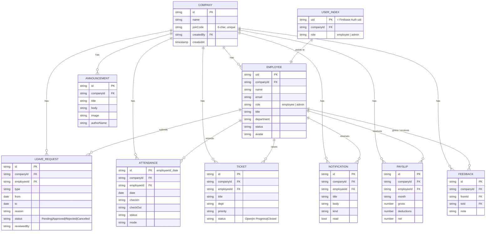

# Database Schema

Firestore in live mode; an equivalent JS-array-per-collection shape in `localStorage` in local mode (see `src/lib/companyStore.js`). The two are kept in exact structural sync on purpose, so the schema below describes both.

## Entity-relationship diagram



## Firestore path layout

```
userIndex/{uid}                                -> { companyId, role }
companies/{companyId}                          -> { name, joinCode, createdBy, createdAt }
companies/{companyId}/employees/{uid}          -> employee profile + role
companies/{companyId}/leaveRequests/{id}
companies/{companyId}/attendance/{employeeId_date}
companies/{companyId}/tickets/{id}
companies/{companyId}/announcements/{id}
companies/{companyId}/notifications/{id}
companies/{companyId}/payslips/{id}
companies/{companyId}/feedback/{id}
users/{uid}/{...}                              -> legacy personal blob (profile edits, documents, settings)
```

## Why this shape

- **`companyId` on every shared document** — the single fact that makes multi-tenant isolation possible: a query and a security rule can both say "only documents where `companyId` matches the company I'm a member of."
- **`employeeId` on records that belong to one person** — lets an employee's own listener filter to just their leave requests/attendance/tickets/notifications/payslips, while HR's listener omits the filter and sees everyone's.
- **`userIndex/{uid}` as a single-document lookup** — avoids making every client scan every company to find out where a given account belongs; it's written once at sign-up and read once per app load.
- **The join code lives on the company doc, not the employee doc** — so it can be looked up by an unauthenticated-except-for-account employee during sign-up, before they're a member of anything.

## Security rules summary (see `firestore.rules` for the full source)

| Rule | Reasoning |
|---|---|
| `isCompanyMember(companyId)` gate on reads of employees/leave/attendance/tickets/announcements | Everyone in a company can see the shared context (team calendar, directory, feed) — but never another company's |
| `isCompanyAdmin(companyId)` required to update leave status, ticket status beyond your own, issue payslips, post announcements | Mirrors real-world HR permissions: approvals are an HR action, not a peer action |
| An employee can always create/update their own `leaveRequests`, `attendance`, and `tickets` docs (`request.resource.data.employeeId == request.auth.uid`) | So the employee doesn't need admin rights just to submit or check in |
| `notifications` are readable/updatable **only** by the employee they belong to | Notifications are inherently personal, even though they're created by another party's action (e.g. HR approving leave) |
| `userIndex/{uid}` is only ever readable/writable by that same uid | Prevents anyone from reading or forging another account's company membership |

## Local-mode equivalent

When no Firebase project is configured, `companyStore.js` stores each collection above as a flat JSON array under `localStorage['pulsehr_local_<collectionName>']`, and every `subscribe*` function re-filters/sorts that array in JS on every write — with writes broadcast to other open tabs via `BroadcastChannel('pulsehr_sync')` so the "real-time, connected" behavior is genuinely observable locally, not just in production.
