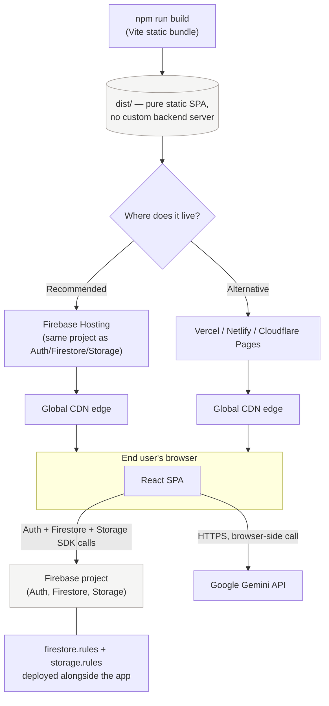

# Deployment

## 0. Deployment architecture



No servers to provision — it's a static bundle on a CDN talking directly to Firebase and Gemini over HTTPS. The only "backend" you own is the Firebase project itself (Auth + Firestore + Storage), configured entirely through `firestore.rules`, `firestore.indexes.json`, and `storage.rules`, all deployed from this repo.

## 1. Build

```bash
npm install
npm run build
```

This produces a static `dist/` folder (Vite). PulseHR AI is a pure SPA — no
server-side rendering, no custom backend server — so it deploys to any static
host.

## 2. Option A — Firebase Hosting (recommended, same project as Auth/Firestore/Storage)

```bash
npm install -g firebase-tools
firebase login
firebase init hosting   # choose "dist" as the public directory, configure as a single-page app: Yes
firebase deploy --only hosting
```

Deploy your security rules and composite indexes at the same time:

```bash
firebase deploy --only firestore:rules,firestore:indexes,storage:rules
```

## 3. Option B — Vercel / Netlify / Cloudflare Pages

- Build command: `npm run build`
- Output directory: `dist`
- Add the same environment variables from `.env` in the host's dashboard
  (`VITE_FIREBASE_*`, `VITE_GEMINI_API_KEY`) — Vite inlines `VITE_`-prefixed
  vars at build time, so they must be present at build, not just at runtime.
- Add a SPA rewrite rule (all routes → `/index.html`) since this uses
  `react-router-dom`'s `BrowserRouter`.

## 4. Environment variables checklist

| Variable | Required for |
|---|---|
| `VITE_FIREBASE_API_KEY` … `VITE_FIREBASE_APP_ID` | Real Auth/Firestore/Storage (omit entirely to run in demo mode) |
| `VITE_GEMINI_API_KEY` | Live AI responses (omit to use the local deterministic fallback) |

## 5. Production hardening (beyond hackathon scope, but the right next step)

- **Move the Gemini call server-side.** `src/lib/aiAssistant.js` currently
  calls `generativelanguage.googleapis.com` directly from the browser for
  hackathon simplicity — the API key is visible in devtools' Network tab.
  Wrap it in a Firebase Cloud Function / Vercel Edge Function / Cloudflare
  Worker and keep the key server-side only.
- **Review `firestore.rules` before scaling past a pilot.** The current
  rules already enforce company-level isolation (see `docs/DATABASE.md`),
  but any new collection you add needs an explicit `match` block — Firestore
  denies by default.
- **Deploy `firestore.indexes.json`.** The company/employee queries in
  `companyStore.js` combine an equality filter with `orderBy`, which
  Firestore can't serve without a composite index — `firebase deploy --only
  firestore:indexes` creates them all in one shot instead of clicking each
  console link individually the first time each query runs.
- **Set a Content Security Policy** allowing `generativelanguage.googleapis.com`
  and your Firebase project's domains.
