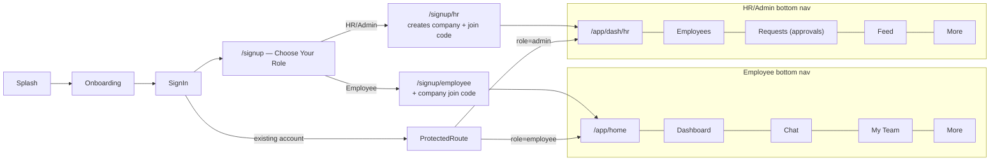
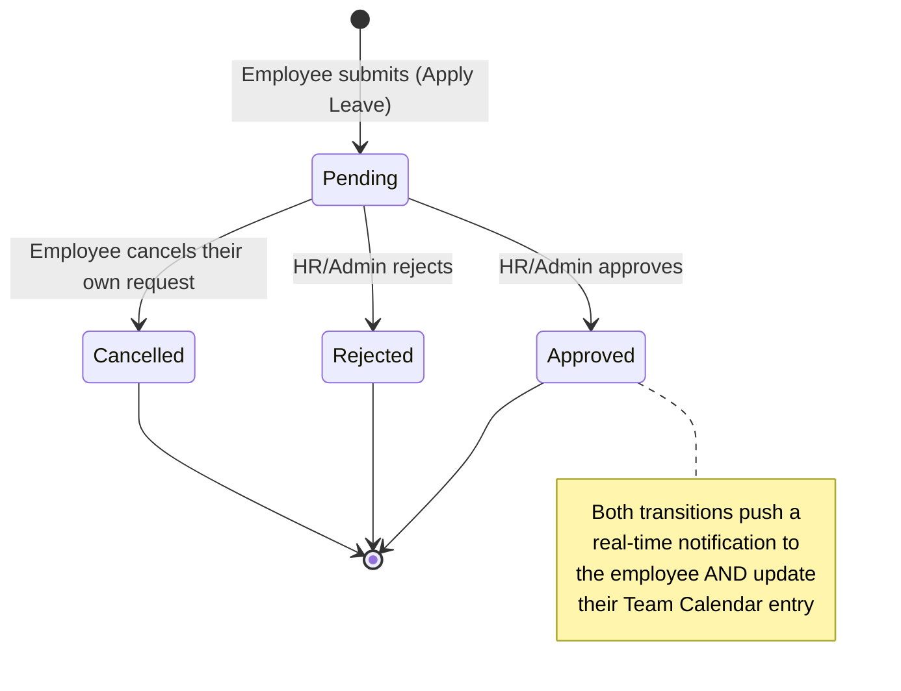
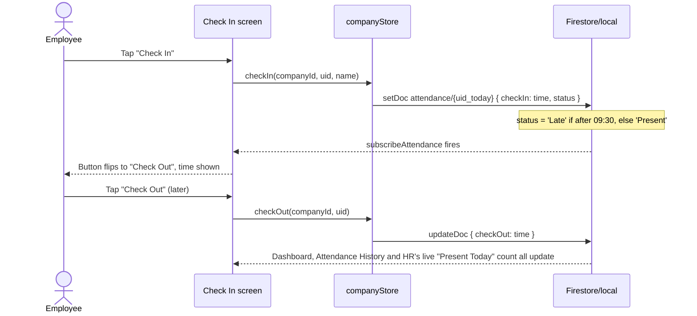
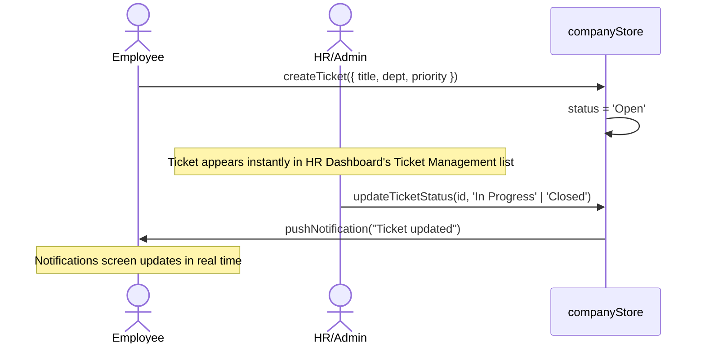
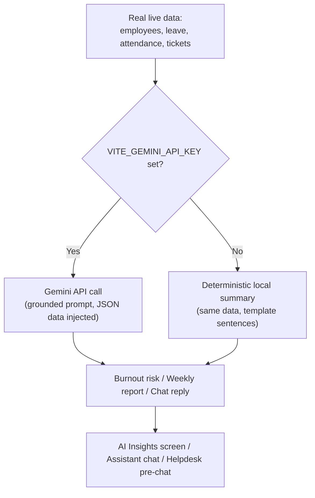
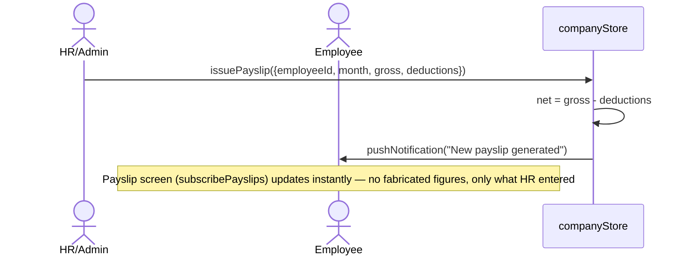
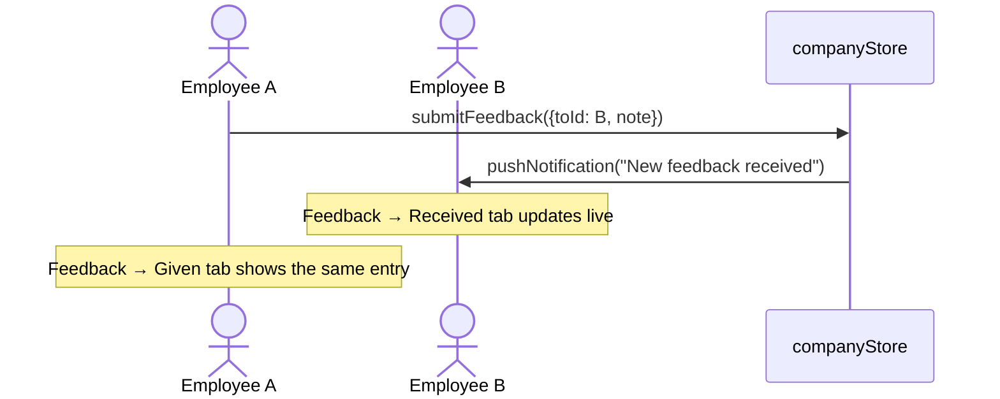
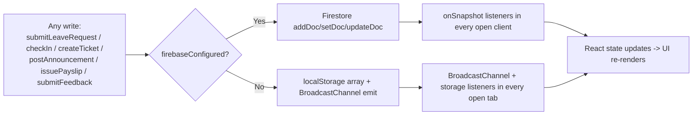

# Diagrams

Every diagram here matches the actual code in `src/` — if you change a flow, please update the matching diagram.

## Navigation & role split

## Leave request lifecycle

## Attendance check-in/out

## Helpdesk ticket flow

## AI Insights & Assistant

Both paths are grounded in the same real subscriptions — the local fallback never invents a number that isn't in the data it was given.

## Payroll issuance

## Peer feedback

## Data flow summary (all shared modules)

